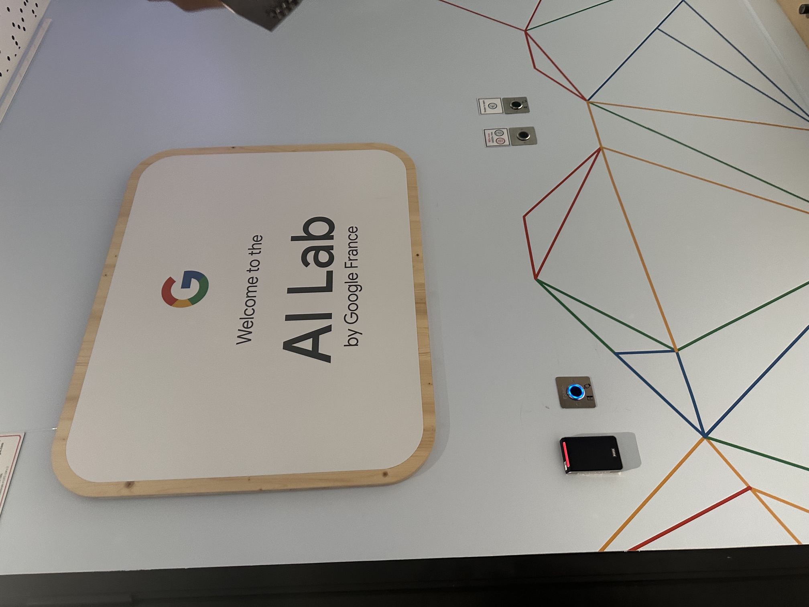
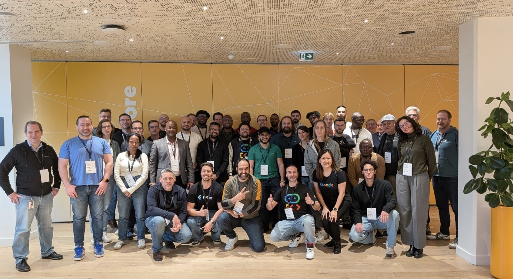
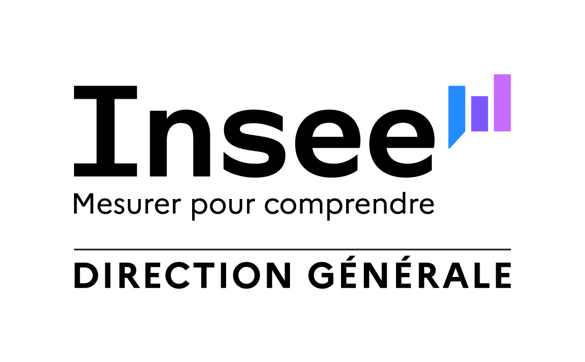
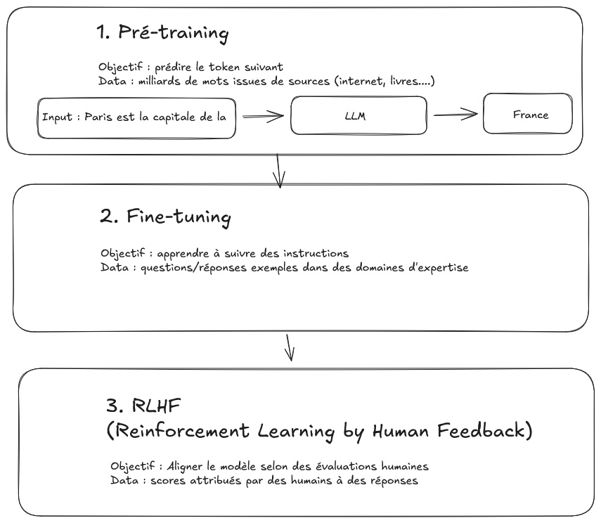
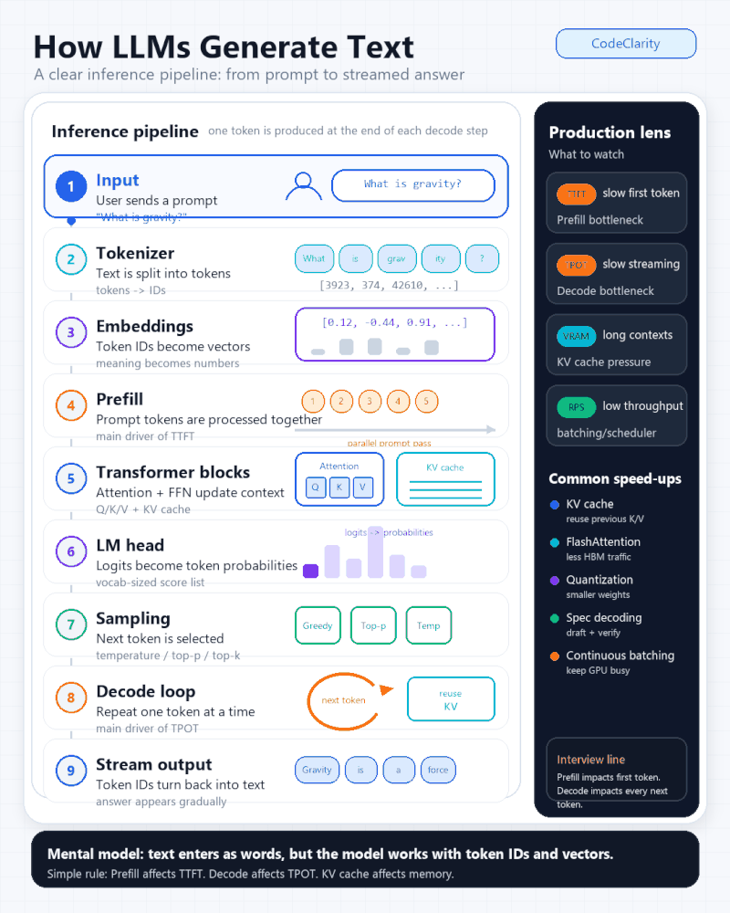
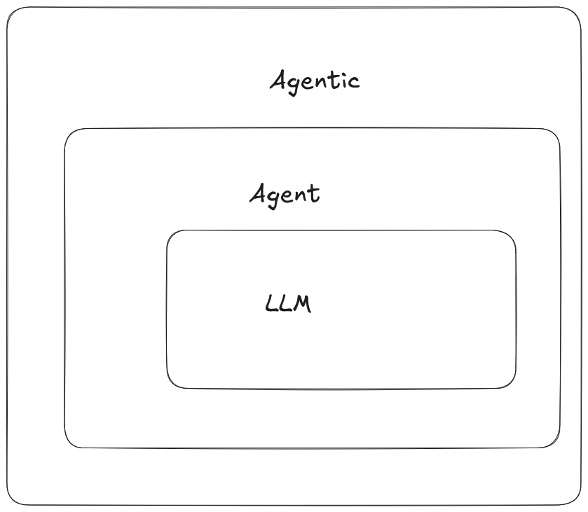

# Pourquoi et comment a été construite cette introduction {#chapters_0 .backgroundTitre_bleu}

## Principaux éléments

   L'IA générative transforme de nombreux aspects en générale mais ma manière de travailler en particulier :

  

- 2022 : arrivée de ChatGPT --\> depuis on ne parle pas seulement de LLMs mais d'agents, MCP, MCP-apps, Skills etc...
  - comprendre clairement de quoi on parlait
  - questions d'utilisation à des fins professionnelles (pas simplement pour résumer du texte)
  - savoir utiliser (ce qu'on peut faire / ce qu'on ne peut pas faire)

  

## Principaux éléments

  

- Premières questions :
  - utiliser LLMs (souveraineté)
  - créer un agent
  - savoir déployer un agent en production
  - trouver les cas d'usages

  

**L’objectif ce cette mini introduction : comprendre basiquement ce qu'est un LLM / clarifier les autres termes .**

## Utiliser l'IA Générative

  

- Impact de l'utilisation de l'IA dans tous les métiers (Marketing, developpeurs ....)\
- Apparition de nouveaux acteurs (`OpenAI`, `Anthropic`...)\
- Apparition de nouveaux termes (`Vibe Coding`)\
- Appartion de nouveaux outils (`Cursor`, `OpenClaw`, `Claude Code`, `Antigravity CLI`)

## Les ressources {#section_0_3 .backgroundStandard_bleu}

  \
  

- Comprendre ce qu'est un LLM : [Build a Large Language Model (From Scratch)](https://github.com/rasbt/LLMs-from-scratch) *from Sebastian Raschka*

- Cours "Build AI agent in production", Certifications

  - Prompt engineering
  - Construire un agent

- Chaîne YouTube [Standford Online](https://www.youtube.com/@stanfordonline)

  - En particulier le cours [CS229 - Machine Learning \| Building Large Language Models (LLMs)](https://youtu.be/9vM4p9NN0Ts?si=C9FNOOKD5cxVIKGj)

## Les ressources {#section_0_4 .backgroundStandard_bleu}

  

- Une formation de formateurs chez Google

|  |  |
|-------------------------------------------|-----------------------------|
| {width="342"} | {width="412"} |

## Les ressources {#section_0_5 .backgroundStandard_bleu}

  

- [Veille ArXiv](https://arxiv.org/)
- [Veille automatisée par IA - N8N](https://docs.google.com/spreadsheets/d/1sPCYfcCh9W-qK0LGAsH32T7y8ahMr0tMiQh5gfLmhyM/edit?gid=0#gid=0)
- [Blog Anthropic](https://www.anthropic.com/research/introducing-anthropic-science)

# Principes généraux LLMs {#chapters_1 .backgroundTitre_violet}

::: logoTopRightTitre

:::

## Vidéo générée (Google Veo) {#section_1_1 .backgroundStandard_violet}

  

<video controls style="width: 95%; max-width: 1100px;">
  <source src="videos/Marylene.mp4" type="video/mp4">
  Votre navigateur ne supporte pas la lecture vidéo.
</video>

## Comment est construit un LLM ? {#section_1_2 .backgroundStandard_violet}

  \
  

::: callout-note
[Lien vers une présentation entièrement Vibe Codée avec Copilot et Antigravity](https://maryleneh.github.io/intro_llm_agentic/)
:::

::: logoTopLeftStandard

:::

## Etapes {#section_1_3 .backgroundStandard_violet}

::: logoTopLeftStandard

:::

## Build an LLM {#section_1_4 .backgroundStandard_violet}

{width="35%" height="50%" fig-align="center"}

  

<!-- Ajout des autres parties du support -->

# Agent / agentic {#chapters_2 .backgroundTitre_jaune}

## Agent IA {#section_2_1 .backgroundStandard_jaune}

  \
  

::: callout-note
[Retour vers la présentation entièrement Vibe Codée avec Copilot et Antigravity](https://maryleneh.github.io/intro_llm_agentic/fr.html#/act-ii)
:::

  

- [Une petite démo](https://huggingface.co/welcome)

## A retenir {#section_2_2 .backgroundStandard_jaune}

  

{width="45%" height="45%" fig-align="center"}

  

## Et le RAG ? {#section_2_2 .backgroundStandard_jaune}

  

<video controls style="width: 95%; max-width: 1100px;">
  <source src="videos/rag_explainer.mp4" type="video/mp4">
  Votre navigateur ne supporte pas la lecture vidéo.
</video>

  

<!-- Ajout des autres parties du support -->

# Gestion des backlogs des applications au DVDSG {#chapters_3 .backgroundTitre_bleu}

## Un ou des agents ? {#section_3_1 .backgroundStandard_bleu}

::: callout-note
[Retour vers la présentation entièrement Vibe Codée avec Copilot et Antigravity](https://maryleneh.github.io/intro_llm_agentic/fr.html#/act-iii)
:::

##  {#pageDeFin .unnumbered .backgroundPageFinale data-menu-title="Page finale"}

:::::: {.columns .coordonneesFinales}
::: {.column .gauche .coordonnees width="30%"}
- Marylène Henry
- marylene.henry\@insee.fr
:::

::: {.column .coordonnees .milieu width="30%"}
:::

::: {.column .coordonnees .droite width="30%"}
:::
::::::